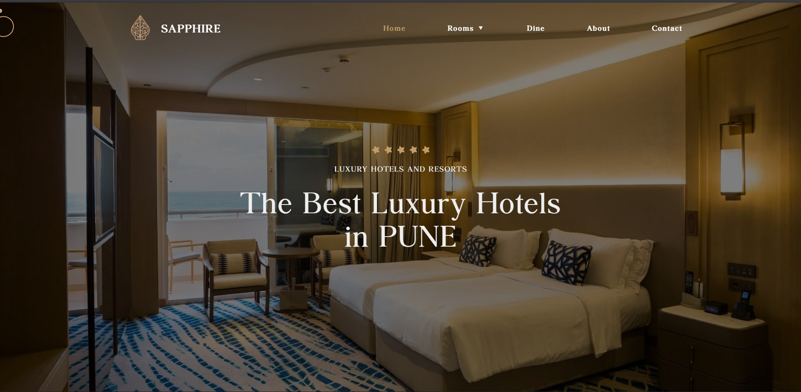

# **SAPPHIRE**

A modern, frontend focused website for showcasing **Sapphire Restaurant Showcase Website**, designed to highlight menu offerings, allow table reservations, and provide an elegant online presence.

---

## 📑 Table of Contents

* [Introduction](#introduction)
* [Features](#features)
* [Tech Stack](#tech-stack)
* [Installation](#installation)
* [Usage](#usage)
* [Folder Structure](#folder-structure)
* [Screenshots](#screenshots)
* [Contributing](#contributing)
* [License](#license)

---

## 📝 Introduction

The **Sapphire Website** is a restaurant web application that provides visitors with menu browsing, reservation booking, and event updates. It is built with modern web technologies for fast performance and a smooth user experience.

---

## ✨ Features

* 🍽 **Menu Showcase** – Displays detailed restaurant menu
* 📅 **Online Reservation** – Book a table directly from the site
* 📷 **Gallery** – Showcases restaurant interiors and dishes
* 📩 **Contact Form** – Easy way to get in touch with the restaurant
* ⚡ **Fast Loading** – Optimized for performance

---

## 🛠 Tech Stack

* **Frontend:** React
* **Styling:** Tailwind CSS / Custom CSS

---

## ⚙️ Installation

1. **Clone the repository**

    Fork the website and then clone it on your local machine

```
git clone https://github.com/your-username/sapphire-website.git
cd sapphire-website
```

2. **Install dependencies**

```
npm install
```

3. **Run the development server**

```
npm run dev   # For Vite / React projects
npm start     # For plain Node.js / Express projects
```

4. **Open in browser**:

```
http://localhost:3000
```

---

## 🚀 Usage

* Navigate through the homepage to explore menu items
* Use the reservation form to book a table
* View the gallery for photos of dishes and interiors
* Contact the restaurant via the contact form

---

## 📂 Folder Structure


```
├── .git/ 🚫 (auto-hidden)
├── backend/
│   ├── node_modules/ 🚫 (auto-hidden)
│   ├── .env 🚫 (auto-hidden)
│   ├── package-lock.json
│   ├── package.json
│   └── server.js
├── node_modules/ 🚫 (auto-hidden)
├── public/
├── src/
│   ├── assets/
│   │   ├── agatho/
│   │   │   ├── Agatho_ BoldCAPS.otf
│   │   │   ├── Agatho_ Light.otf
│   │   │   ├── Agatho_ LightCAPS.otf
│   │   │   ├── Agatho_ Narrow.otf
│   │   │   ├── Agatho_ RegularCAPS.otf
│   │   │   ├── Agatho_Bold.otf
│   │   │   ├── Agatho_Medium.otf
│   │   │   └── Agatho_Regular.otf
│   │   ├── fonts/
│   │   │   ├── agatho/
│   │   │   │   ├── Agatho_ BoldCAPS.otf
│   │   │   │   ├── Agatho_ Light.otf
│   │   │   │   ├── Agatho_ LightCAPS.otf
│   │   │   │   ├── Agatho_ Narrow.otf
│   │   │   │   ├── Agatho_ RegularCAPS.otf
│   │   │   │   ├── Agatho_Bold.otf
│   │   │   │   ├── Agatho_Medium.otf
│   │   │   │   └── Agatho_Regular.otf
│   │   │   └── agatho.rar
│   │   └── images/
│   │       ├── cocktails/
│   │       │   ├── cosmopolitan.jpg
│   │       │   ├── margarita.jpg
│   │       │   ├── martini.jpg
│   │       │   ├── mojito1.jpg
│   │       │   └── old-fashioned.jpg
│   │       ├── desserts/
│   │       │   ├── brownie.jpg
│   │       │   ├── cheesecake.jpg
│   │       │   ├── chocolate-cake.jpg
│   │       │   ├── gulab-jamun.jpg
│   │       │   ├── ice-cream.jpg
│   │       │   └── rasmalai.jpg
│   │       ├── facilities/
│   │       │   ├── gym.png
│   │       │   ├── pool.png
│   │       │   ├── resto.png
│   │       │   └── spa.png
│   │       ├── find-room-img/
│   │       │   ├── Garden-view-room.jpg
│   │       │   ├── dulex_room.jpg
│   │       │   ├── executive-suite-room.jpg
│   │       │   ├── family-room.jpg
│   │       │   ├── honeymoon-suite.jpg
│   │       │   ├── luxury-room.jpg
│   │       │   ├── presidential-suite.jpg
│   │       │   ├── sea-view-room.jpg
│   │       │   ├── standard-room.jpg
│   │       │   └── super-deluxe-room.jpg
│   │       ├── footer-img/
│   │       │   ├── 1.jpg
│   │       │   ├── 2.jpg
│   │       │   ├── 3.jpg
│   │       │   ├── 4.jpg
│   │       │   ├── 5.jpg
│   │       │   ├── 6.jpg
│   │       │   ├── 7.jpg
│   │       │   └── 8.jpg
│   │       ├── home-page/
│   │       │   └── image.jpg
│   │       ├── mocktails/
│   │       │   ├── berry-mocktail.jpg
│   │       │   ├── fruit-punch.jpg
│   │       │   ├── lemon-iced-tea.jpg
│   │       │   ├── mojito.jpg
│   │       │   └── virgin-colada.jpg
│   │       ├── nonveg-menu/
│   │       │   ├── butter-chicken.jpg
│   │       │   ├── chicken-biryani.jpg
│   │       │   ├── chicken-caesar.jpg
│   │       │   ├── chicken-curry.jpg
│   │       │   ├── chicken-manchow.jpg
│   │       │   ├── chicken-shorba.jpg
│   │       │   ├── chicken-sweetcorn.jpg
│   │       │   ├── chicken-tikka.jpg
│   │       │   ├── chicken-wings.jpg
│   │       │   ├── corn-cucumber-salad.jpg
│   │       │   ├── egg-chicken-salad.jpg
│   │       │   ├── fish-amritsari.jpg
│   │       │   ├── fish-salad.jpg
│   │       │   ├── hot-sour-chicken.jpg
│   │       │   ├── mutton-roganjosh.jpg
│   │       │   ├── mutton-seekh.jpg
│   │       │   └── tandoori-salad.jpg
│   │       ├── room-details/
│   │       │   └── room.jpg
│   │       ├── team-images/
│   │       │   ├── Executive Chef.jpg
│   │       │   ├── Guest Relations Manager.jpg
│   │       │   ├── Hospitality Manager.jpeg
│   │       │   └── general-manager.jpg
│   │       ├── veg-menu/
│   │       │   ├── aloo-tikki.jpg
│   │       │   ├── chole.jpg
│   │       │   ├── corn-cucumber-salad.jpg
│   │       │   ├── dal-makhani.jpg
│   │       │   ├── fruit-chaat-salad.jpg
│   │       │   ├── hara-bhara-kabab.jpg
│   │       │   ├── hot-sour.jpg
│   │       │   ├── kachumber-salad.jpg
│   │       │   ├── manchow.jpg
│   │       │   ├── paneer-butter-masala.jpg
│   │       │   ├── paneer-tikka.jpg
│   │       │   ├── sprouts-salad.jpg
│   │       │   ├── sweetcorn-soup.jpg
│   │       │   ├── tomato-shorba.jpg
│   │       │   ├── veg-biryani.jpg
│   │       │   └── veg-seekh.jpg
│   │       ├── contactbg.png
│   │       ├── facebookicon.png
│   │       ├── horizontal-logo.png
│   │       ├── instaicon.png
│   │       ├── linkdinicon.png
│   │       ├── logo-only-nobg.png
│   │       ├── logo.png
│   │       ├── room.webp
│   │       ├── roombg-darker.png
│   │       ├── roombg.png
│   │       ├── table1.jpg
│   │       ├── table2.jpeg
│   │       ├── tablebg-darker.png
│   │       ├── tablebg.png
│   │       └── xicon.png
│   ├── components/
│   │   ├── Card.jsx
│   │   ├── Facilities.jsx
│   │   ├── Footer.jsx
│   │   ├── HotelShowcase.jsx
│   │   ├── MemberCard.jsx
│   │   ├── Navbar.jsx
│   │   └── ScrollToTop.jsx
│   ├── pages/
│   │   ├── About.jsx
│   │   ├── Contact.jsx
│   │   ├── Dine.jsx
│   │   ├── FindRoom.jsx
│   │   ├── Home.jsx
│   │   ├── RoomDetails.jsx
│   │   └── RoomsSuits.jsx
│   ├── styles/
│   │   ├── Card.module.css
│   │   ├── Contact.module.css
│   │   ├── Dine.module.css
│   │   ├── Facilities.module.css
│   │   ├── FindRoom.module.css
│   │   ├── Home.module.css
│   │   ├── HotelShowcase.module.css
│   │   ├── MemberCard.module.css
│   │   ├── RoomDetails.module.css
│   │   └── navbar.module.css
│   ├── App.jsx
│   ├── index.css
│   └── main.jsx
├── test/
│   └── test.html
├── .gitignore
├── README.md
├── eslint.config.js
├── index.html
├── package-lock.json
├── package.json
└── vite.config.js
```

---

## 📸 Screenshot




---

## 👥 Team Members

* **Team Leader: [Parth Mangire](https://github.com/thisisparth187)** 
* **[Ayush Kulkarni](https://github.com/AyushK96-sudo)** 
* **[Riya Chinchankar](https://github.com/RiyaChinchankar)** 
* **[Pradnya Gavali](https://github.com/pradnyagavali27)**

---

## 🤝 Contributing

Contributions are welcome! Please fork this repository and submit a pull request for any enhancements or bug fixes.

---

## 📜 License

This is a open source porject and can be used freely by anyone
